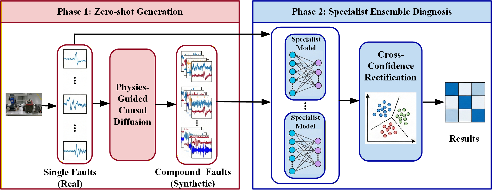

# Physics-Guided-Causal-Diffusion-with-Confidence-Rectified-Ensemble

[](https://pytorch.org/)
[](LICENSE)
[]()

This repository contains the official PyTorch implementation of the paper:

**Physics-Guided Causal Diffusion with Confidence-Rectified Ensemble for Generalized Zero-Shot Compound Fault Diagnosis** *Submitted to IEEE Transactions on Industrial Informatics*

## 📝 Abstract

Generalized Zero-Shot Learning (GZSL) in machinery fault diagnosis aims to identify novel compound faults (unseen) using only single-fault data (seen). Traditional generative methods often fail to capture the physical coupling of fault signatures, leading to poor generalization.

We propose **PGCD-CRE**, a novel framework that bridges the semantic gap through physical causality.
Key innovations include:
1.  **Physics-Guided Causal Diffusion:** Generates high-fidelity unseen compound fault signals by enforcing physical envelope constraints and multi-hot causal conditioning.
2.  **Specialist Ensemble Diagnosis:** A diagnostic strategy with Cross-Confidence Rectification to resolve spectral confusion between similar compound faults (e.g., Inner-Ball vs. Outer-Ball).



## 💾 Data Preparation

1. XJTU Gearbox Dataset
Download the dataset from the XJTU Website and organize files as follows:

```bash
dataset/xjtu/
├── 1ndBearing_ball/ 
│   └── Data_Chan1.txt
├── 1ndBearing_inner/ 
│   └── Data_Chan1.txt
├── 1ndBearing_outer/ 
│   └── Data_Chan1.txt
└── 1ndBearing_mix(inner+outer+ball)/ 
    └── Data_Chan1.txt
```
2. HUST Bearing Dataset
Download the dataset and organize files as follows:

```bash
dataset/hust/
├── N504.mat
├── B504.mat
├── I504.mat
├── O504.mat
├── IB504.mat
└── OB504.mat
```

## 🚀 Usage

Scenario I: Single Unseen Target (XJTU Dataset)

Please use main_gzsl_xjtu.py to train the PGCD for single compound fault (IOB) diagnosis using XJTU dataset.

The results (Seen Acc, Unseen Acc and H-score) will also be given.


Scenario II: Multiple Unseen Targets (HUST Dataset).

Please use main_gzsl_hust.py to train the PGCD for single compound fault (IOB) diagnosis using HUST dataset. 
Then use hust_gzsl_sp_model.py to train the spelialist model.
Finally use the hust_gzsl_sp_model_confidence.py to get the results (Seen Acc, Unseen Acc and H-score).


