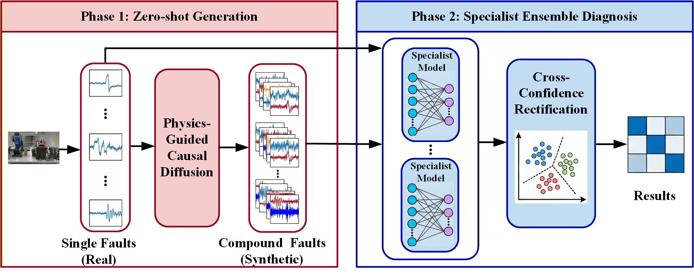

# Physics-Guided Compositional Diffusion with Confidence-Rectified Ensemble

Official PyTorch implementation of **PGCD-CRE** for generalized zero-shot
compound-fault diagnosis.

PGCD synthesizes candidate compound-fault signals from real single-fault data
using multi-hot compositional conditioning and transfer-path-weighted envelope
guidance. CRE then performs validation-calibrated, transductive diagnosis with
candidate-specific specialists, density-based cluster discovery, and
cross-specialist confidence rectification.

> **Terminology.** The method is *compositional*, not a formal causal-inference
> model. The historical filename `causal_diffusion_model.py` is retained for
> compatibility; it does not implement a structural causal model,
> interventions, or counterfactual inference.

## Framework

<p align="center">
  
</p>

The framework contains two stages:

1. **Zero-shot generation:** a shared diffusion model is trained on real seen
   single faults and synthesizes candidate compound faults with compositional
   conditioning and differentiable envelope-spectrum guidance.
2. **Specialist ensemble diagnosis:** one specialist is trained for each
   candidate semantic. At inference, CRE filters seen samples, discovers the
   batch cluster structure, maps supported clusters through validation-only
   confidence and physical signatures, and applies a calibrated fallback to
   density-noise points.

## Scope and assumptions

- A physically feasible candidate compound-fault dictionary is defined before
  deployment.
- One specialist is trained for each candidate semantic.
- The active candidate subset and the number of test-batch clusters are not
  supplied at inference.
- HDBSCAN discovers data-dependent clusters; it does not discover arbitrary new
  fault semantics outside the predefined dictionary.
- Real compound-fault signals and labels are never used for model fitting,
  normalization, or threshold calibration.
- CRE is transductive and requires an unlabeled test batch or short feature
  buffer.

## Repository structure

```text
.
|-- assets/
|   `-- framework.png
|-- causal_diffusion_model.py          # 1D U-Net, DDPM, physics loss/sampling
|-- data_loader.py                     # strict temporal XJTU loader
|-- hust_data.py                       # strict temporal HUST loader
|-- main_gzsl_xjtu.py                  # XJTU training and GZSL evaluation
|-- main_gzsl_hust.py                  # HUST candidate generation
|-- hust_gzsl_sp_model.py              # HUST specialist training
|-- hust_gzsl_sp_model_confidence.py   # HDBSCAN-CRE inference and metrics
|-- corrected_generation_ablation.py   # XJTU generator ablation/sensitivity
|-- corrected_diagnostic_ablation.py   # HUST diagnostic/AWGN ablation
|-- distribution_audit.py              # MMD and temporal-drift audit
|-- aggregate_results.py               # three-seed aggregation
|-- plot_corrected_ablation_figures.py # Figure 7/Figure 9 regeneration
|-- requirements.txt
`-- README.md
```

## Data preparation

The code expects the following layout:

```text
dataset/
|-- xjtu/
|   |-- 1ndBearing_ball/Data_Chan1.txt
|   |-- 1ndBearing_inner/Data_Chan1.txt
|   |-- 1ndBearing_outer/Data_Chan1.txt
|   `-- 1ndBearing_mix(inner+outer+ball)/Data_Chan1.txt
`-- hust/
    |-- N504.mat
    |-- B504.mat
    |-- I504.mat
    |-- O504.mat
    |-- IB504.mat
    `-- OB504.mat
```

The loaders enforce the revised protocol:

1. split each trace chronologically into 60% training, 20% validation, and 20%
   testing **before** windowing;
2. create non-overlapping windows of length and stride 1024;
3. estimate one mean/standard-deviation pair from seen training blocks only;
4. reuse those statistics for validation, seen testing, synthetic data, and
   real compound-fault testing;
5. expose only the final 20% of each real compound trace for evaluation.

Raw XJTU and HUST recordings are subject to their original licenses. They are
not intended to be redistributed with a source-only release; obtain them from
their original providers and place them in the paths above.

## Environment

The corrected experiments were run with Python 3.10. A CUDA-capable GPU is
recommended for diffusion training, although the scripts automatically fall
back to CPU.

```bash
python -m venv .venv
```

Windows PowerShell:

```powershell
.venv\Scripts\Activate.ps1
python -m pip install --upgrade pip
pip install -r requirements.txt
```

Linux/macOS:

```bash
source .venv/bin/activate
python -m pip install --upgrade pip
pip install -r requirements.txt
```

`scikit-learn>=1.3` is required because CRE uses
`sklearn.cluster.HDBSCAN`.

## Reproducing the main results

Run all commands from the repository root. The paper reports seeds 0, 1, and
2, uses 50 diffusion-training epochs, 80 XJTU classifier epochs, and 50 HUST
specialist epochs. These environment variables make the paper configuration
explicit instead of relying on development defaults.

### XJTU

```powershell
$env:PGCD_DIFFUSION_EPOCHS = "50"
$env:PGCD_CLASSIFIER_EPOCHS = "80"
$env:PGCD_SYNTHETIC_SAMPLES = "1200"
$env:PGCD_REFINE_STEPS = "120"
$env:PGCD_GUIDANCE_SCALE = "10"

0..2 | ForEach-Object {
    $env:PGCD_SEED = "$_"
    python main_gzsl_xjtu.py
}
```

Outputs are written to `results_xjtu_strict/seed_<seed>/`.

### HUST

The HUST workflow is sequential: generate candidate signals, train the two
specialists, and then run CRE inference.

```powershell
$env:PGCD_DIFFUSION_EPOCHS = "50"
$env:PGCD_SYNTHETIC_SAMPLES = "800"
$env:PGCD_REFINE_STEPS = "150"
$env:PGCD_GUIDANCE_SCALE = "10"
$env:PGCD_SPECIALIST_EPOCHS = "50"

0..2 | ForEach-Object {
    $env:PGCD_SEED = "$_"
    python main_gzsl_hust.py
    python hust_gzsl_sp_model.py
    python hust_gzsl_sp_model_confidence.py
}
```

The three stages write to:

```text
results_hust_generation_strict/seed_<seed>/
results_hust_ensemble_strict/seed_<seed>/
results_hust_confidence_strict/seed_<seed>/
```

### Aggregate the three seeds

```bash
python aggregate_results.py
```

This creates:

```text
results_aggregated_strict/retraining_summary.csv
results_aggregated_strict/retraining_summary.json
```

The aggregator uses the sample standard deviation (`ddof=1`) and explicitly
excludes smoke-test seed 999.

## Distribution and temporal-drift audit

Run the audit after both XJTU and HUST outputs exist for a seed:

```powershell
0..2 | ForEach-Object {
    $env:PGCD_SEED = "$_"
    python distribution_audit.py
}
```

The audit computes evaluation-only synthetic-real envelope-spectrum MMD and
seen-train versus seen-test temporal-domain statistics. Real unseen data enter
only this post-training evaluation.

## Corrected component ablations

The ablation scripts reuse the completed strict-protocol checkpoints. They do
not use the legacy random-window protocol.

### XJTU generation ablation

Requires `results_xjtu_strict/seed_0..2/compositional_diffusion.pth`:

```bash
python corrected_generation_ablation.py --mode ablation --seeds 0 1 2
```

This compares raw signal mixup, one-hot DDPM plus mixing, compositional DDPM
with `s=0`, equal-weight PGCD, and transfer-weighted PGCD using the same
pointwise shared CNN.

### Guidance-scale sensitivity

```bash
python corrected_generation_ablation.py --mode sensitivity --seeds 0 1 2
```

The sweep evaluates `s = {0, 2.5, 5, 7.5, 10, 12.5, 15, 20}`. It is a
post-hoc sensitivity analysis and is not used to select the predeclared
operational setting `s=10` from real unseen labels.

### HUST diagnostic and AWGN ablation

Requires the completed HUST synthetic datasets and specialist checkpoints for
seeds 0, 1, and 2:

```bash
python corrected_diagnostic_ablation.py
```

This produces the corrected diagnostic variants and the 10 to -10 dB AWGN
robustness curves for K-Means-CRE and HDBSCAN-CRE.

### Regenerate the paper figures

```bash
python plot_corrected_ablation_figures.py
```

Editable SVG/PDF and publication-resolution PNG/TIFF files are written to
`results_corrected_ablation/figures/`. The manuscript raster copies are also
updated in the parent workspace when that path is available.

## Corrected three-seed results

All values are mean +/- sample standard deviation over seeds 0, 1, and 2. No
seed was removed based on test performance.

| Dataset | Seen accuracy | Unseen accuracy | H-score |
|---|---:|---:|---:|
| XJTU | 95.93 +/- 2.26% | 98.97 +/- 1.59% | 97.42 +/- 1.63% |
| HUST | 95.50 +/- 1.32% | 94.50 +/- 1.73% | 95.00 +/- 1.52% |

The lightweight result summaries used by the revised manuscript are stored in:

```text
results_aggregated_strict/
results_corrected_ablation/
results_distribution_audit/
```

Training states, generated tensors, smoke-test seed 999, wrong-sign diagnostic
artifacts, and uncalibrated diagnostic variants are not reportable manuscript
results.

## Reproducibility safeguards

- Python, NumPy, and PyTorch RNGs are seeded by `PGCD_SEED`.
- cuDNN deterministic mode is enabled and benchmarking is disabled.
- Data are split chronologically before windowing.
- Normalization statistics are fitted on seen training data only.
- Candidate and seen thresholds use real seen validation and held-out synthetic
  validation data only.
- Real compound-fault labels do not select thresholds or hyperparameters.
- Seed 999 and explicitly marked diagnostic artifacts are excluded from formal
  aggregation.

## Checkpoints and large artifacts

The scripts can retrain models from scratch. For a lightweight source release,
do not commit optimizer/training states, processed caches, generated tensors,
or raw datasets. If pretrained inference checkpoints are released, publish
them separately and provide checksums for:

```text
results_xjtu_strict/seed_<seed>/compositional_diffusion.pth
results_xjtu_strict/seed_<seed>/classifier.pth
results_hust_generation_strict/seed_<seed>/compositional_diffusion.pth
results_hust_ensemble_strict/seed_<seed>/Specialist_IB.pth
results_hust_ensemble_strict/seed_<seed>/Specialist_OB.pth
```

## Citation

If this repository supports your research, please cite the accompanying paper.
The final bibliographic entry and DOI will be added after publication.

## License

A software license has not yet been assigned in this workspace. Add a
repository-level `LICENSE` file before public release. Dataset licenses remain
independent of the software license.
